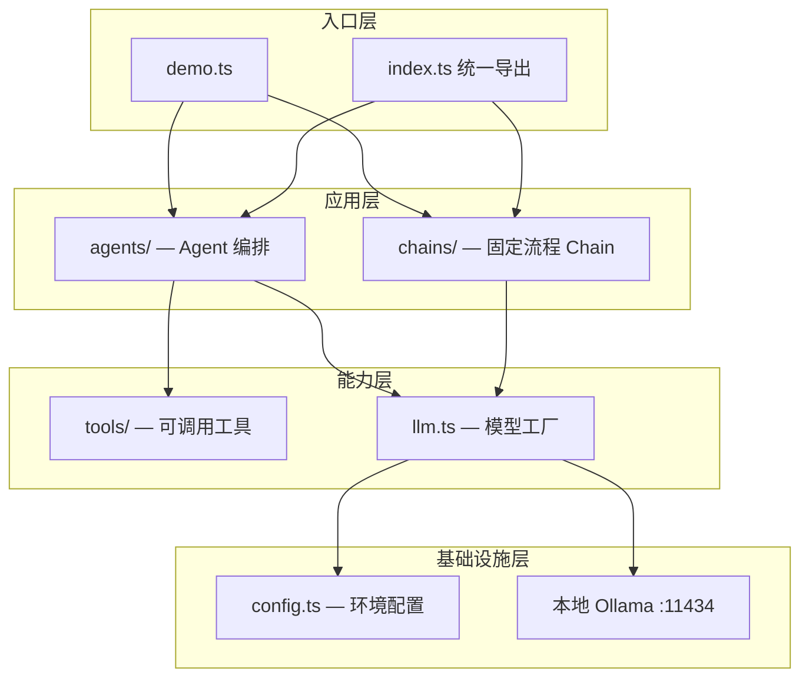

`agent` 模块是一个独立子包，按**分层 + 工厂函数**组织，把配置、模型、工具、Chain、Agent 拆开，方便后续扩展。

## 整体分层



从上到下：**入口 → 应用编排 → 模型/工具 → 配置/Ollama**。

---

## 各层职责

### 1. 配置层 — `config.ts`

从环境变量读取 Ollama 连接信息，提供统一默认值：

- `OLLAMA_BASE_URL` → 默认 `http://127.0.0.1:11434`
- `OLLAMA_MODEL` → 默认 `llama3.2`
- `OLLAMA_TEMPERATURE` → 默认 `0.2`

这一层不依赖 LangChain，只负责「连哪台机器、用哪个模型」。

### 2. 模型层 — `llm.ts`

`createOllamaLLM()` 是唯一的 LLM 入口，内部创建 `ChatOllama` 实例：

```4:12:agent/src/llm.ts
export function createOllamaLLM(overrides: Partial<AgentConfig> = {}): ChatOllama {
  const config = { ...loadConfig(), ...overrides };

  return new ChatOllama({
    baseUrl: config.ollamaBaseUrl,
    model: config.model,
    temperature: config.temperature,
    maxRetries: 2,
  });
}
```

Chain 和 Agent 都通过它拿模型，避免各处重复 new `ChatOllama`，也方便测试时注入 mock。

### 3. 工具层 — `tools/index.ts`

用 LangChain 的 `tool()` + Zod schema 定义模型可调用的函数：

| 工具 | 作用 |
|------|------|
| `echo` | 回显文本，验证 tool calling 链路 |
| `get_current_time` | 返回当前 UTC 时间，演示「模型无法直接知道的信息」 |

`defaultTools` 是默认工具集，创建 Agent 时可直接使用。

### 4. Chain 层 — `chains/index.ts`

Chain 是**固定、线性的 LLM 流水线**，适合「输入 → 处理 → 输出」一类任务：

```
PromptTemplate → ChatOllama → StringOutputParser
```

`createSummarizeChain()` 把开发者笔记摘要成短文本。没有工具、没有多轮决策，流程确定、开销更小。

### 5. Agent 层 — `agents/index.ts`

Agent 是**能自主决定是否调工具**的编排体：

```16:24:agent/src/agents/index.ts
export function createDeveloperAgent(options: CreateDeveloperAgentOptions = {}) {
  const llm = options.llm ?? createOllamaLLM();
  const tools = options.tools ?? defaultTools;

  return createAgent({
    model: llm,
    tools,
    systemPrompt: SYSTEM_PROMPT,
  });
}
```

LangChain 的 `createAgent` 在底层会跑一个 **ReAct 循环**：

1. 读用户消息 + system prompt  
2. 模型决定：直接回答，或调用某个 tool  
3. 若有 tool call → 执行工具 → 把结果塞回上下文  
4. 重复直到给出最终回复  

`CreateDeveloperAgentOptions` 支持注入自定义 `llm` / `tools`，便于单测或换模型。

### 6. 入口层

- **`index.ts`**：对外统一导出，其他模块（如 backend）只需 `import { createDeveloperAgent } from '...'`  
- **`demo.ts`**：演示两条路径  
  1. Chain：`createSummarizeChain().invoke({ text })`  
  2. Agent：`createDeveloperAgent().invoke({ messages })`

---

## Demo 实际执行流程

你跑 `npm run agent:demo` 时，大致是这样：

```
demo.ts
  │
  ├─ [Chain 路径]
  │    loadConfig() → createSummarizeChain()
  │    → Prompt 填充 "LangChain agent initialized..."
  │    → Ollama 生成摘要 → StringOutputParser 输出字符串
  │
  └─ [Agent 路径]
       createDeveloperAgent()
       → 用户问 "What time is it right now?"
       → 模型识别需要实时信息
       → 调用 get_current_time tool
       → 拿到 ISO 时间后组织自然语言回复
```

Chain 走**单轮、固定管道**；Agent 走**多步推理 + 工具调用**。

---

## Chain vs Agent 怎么选

| | Chain | Agent |
|---|-------|-------|
| 流程 | 固定（Prompt → LLM → Parser） | 动态（模型自己决定下一步） |
| 工具 | 不支持 | 支持 |
| 适用 | 摘要、翻译、格式化等确定性任务 | 问答、查时间、后续可接脚本执行等 |
| 成本 | 通常 1 次 LLM 调用 | 可能多轮（含 tool 往返） |

当前 demo 故意展示两种模式，方便你按场景选用。

---

## 扩展方向

按现有结构，后续可以这样加能力，而不必大改：

1. **`tools/`** — 加调用 backend API、读剪贴板、执行脚本等工具  
2. **`chains/`** — 加脚本生成、日志分析等固定流水线  
3. **`agents/`** — 换 system prompt，或组合更多工具成「开发者助手」  
4. **`config.ts`** — 加 embedding 模型、超时、上下文长度等配置  
5. **接入 backend** — 在 Fastify 路由里 `import { createDeveloperAgent } from '../agent/dist/index.js'`，把 HTTP 请求转成 `messages` 传入

整体是**薄封装 + 工厂函数**：配置集中、模型单点创建、Chain/Agent 各司其职，和主项目的 backend / frontend / electron 保持独立，可以单独开发、单独跑 demo。